=============================================================================================================================================================
Máster en Software Craftsmanship. Módulo Experto en Aseguramiento de la Calidad del Software (EACS). Asignatura Integración continua. Memoria de la Práctica.
=============================================================================================================================================================

:Autor: Antonio Camas Maestre
:git: https://github.com/antoniocamas/tic-tac-toe-testing-ci

.. header:: EACS. Integración Continua. Práctica
   
.. sectnum:: 
   
.. contents:: Contenidos
	      
.. raw:: pdf

   PageBreak

Configuración de un Pipeline de integración contínua
========================================================

Máster en Software Craftsmanship. Módulo Experto en Aseguramiento de la Calidad del Software (EACS). Asignatura Integración continua.

Configuración Inicial
---------------------

Esta práctica ha sido realizada con la primera versión de la forma que se proporcionó en clase donde había varías funcionalidades que faltaban como la conexión Gerrit Jenkins.

Antes de poder crear los jobs de Jenkins será necesario configurar algunos servicios::

  - Creación de usuarios.
  - Jenkins.
  - Gerrit.
  - Instalar y configurar SonarQube

Creación de los usuarios Antonio y hudson
-----------------------------------------

La creación del usuario *Antonio* no es estrictamente necesaria, pero servirá para facilitar el trabajo en mi entorno
de trabajo pues podré usar el mismo usuario que ya uso en otros proyectos de Git.

El usuario *hudson* es un usuario funcional no interactivo necesario para que funcione el plugin the gerrit. como recoge la
documentación del plugin::

   Gerrit access rights
   Create the profile through in Gerrit web interface for your Jenkins user,
     and set up a SSH key for that user.
   Gerrit web interface > Admin > Groups > Non-Interactive Users >
                                                      Add your jenkins user.
   Admin > Projects > ... > Access > Edit
   Reference: refs/*
   Read: ALLOW for Non-Interactive Users
   Reference: refs/heads/*
   Label Code-Review: -1, +1 for Non-Interactive Users
   Label Verified: -1, +1 for Non-Interactive Users

   IMPORTANT: On Gerrit 2.7+, you also need to grant "Stream Events" capability.
   Without this, the plugin will not work, will try to connect to Gerrit repeatedly,
   and will eventually cause OutOfMemoryError on Gerrit.

   Gerrit web interface > People > Create New Group : "Event Streaming Users".
                                                               Add your jenkins user.
   Admin > Projects > All-Projects > Access > Edit
   Global Capabilities
   Stream Events: ALLOW for Event Streaming Users

Link to `Gerrit_documentation <http://gerrit-documentation.googlecode.com/svn/Documentation/2.4.2/access-control.html#examples_cisystem>`_.
   
Link to `Stream Events documentation  <https://gerrit-documentation.googlecode.com/svn/Documentation/2.7/access-control.html#capability_streamEvents>`_.
   
Para poder crear tags y hacer commits al repositorio serán necesarios otros permisos adicionales. Ver sección `Permisos de gerrit para el usuarios de jenkins`_ del job de release.
   

LDAP
^^^^

Entrar en phpDLAPadmin y crear el usuario Antonio con valores equivalentes a los que tiene los usuarios dev1 y dev2

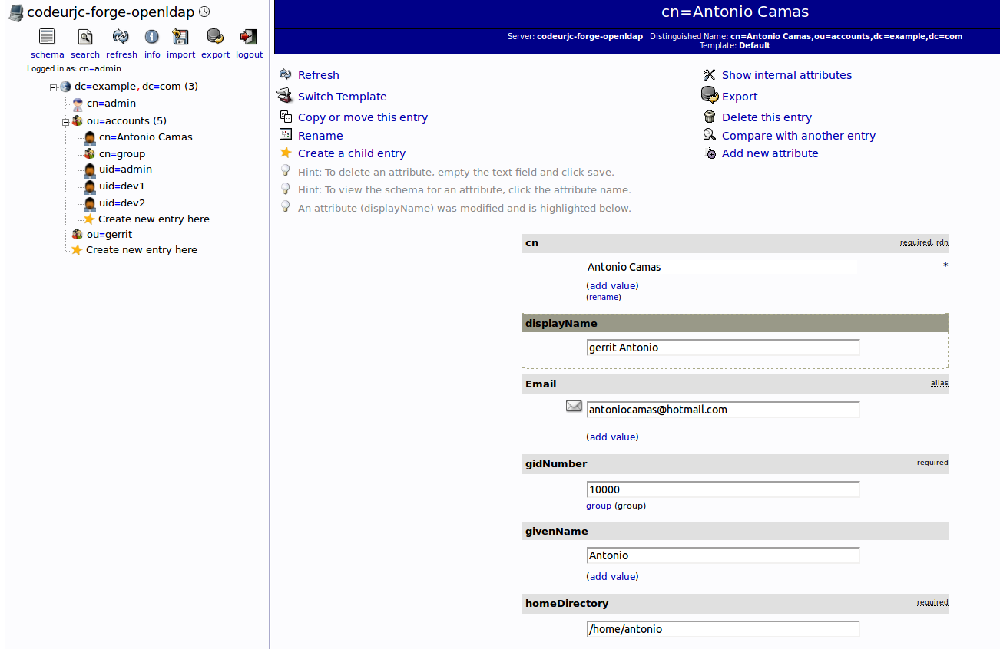
	 
   Creación del usuario Antonio en LDAP

Configurar usuario en Gerrit
^^^^^^^^^^^^^^^^^^^^^^^^^^^^

Entrar en Gerrit como el usuario *Antonio* para crear la cuenta.
Salir de gerrit y volver a entrar como *admin*

Meter al usuario *Antonio* en el grupo *Developers*.

Settings->Groups->Developers->Members-> Add

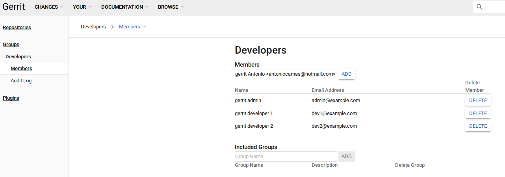
	 
   Configuración de usuario en Grupo

Añadir la clave ssh pública del usuario *Antonio*.

Repetir estos para pasos para el usuario *hudson* pero añadir al grupo *Non-Interactive Users*

    
Configuración Jenkins
----------------------

Plugin the Gerrit
^^^^^^^^^^^^^^^^^

Es necesario instalar y configurar el Plugin the Gerrit para para poder comunicar Jenkins con el servicio Gerrit.

Antes hay que averiguar la clave pública ssh de jenkins y darla de alta para el usuario *hudson* en Gerrit.

Para ello, conectarse al contenedor de Jenkins e imprimir la clave id_rsa.pub.

.. code:: bash
	  
	  docker exec $(docker ps | grep jenkins| cut -d' ' -f1) \
	                            cat /var/jenkins_home/.ssh/id_rsa.pub
	  

Ver imagen:

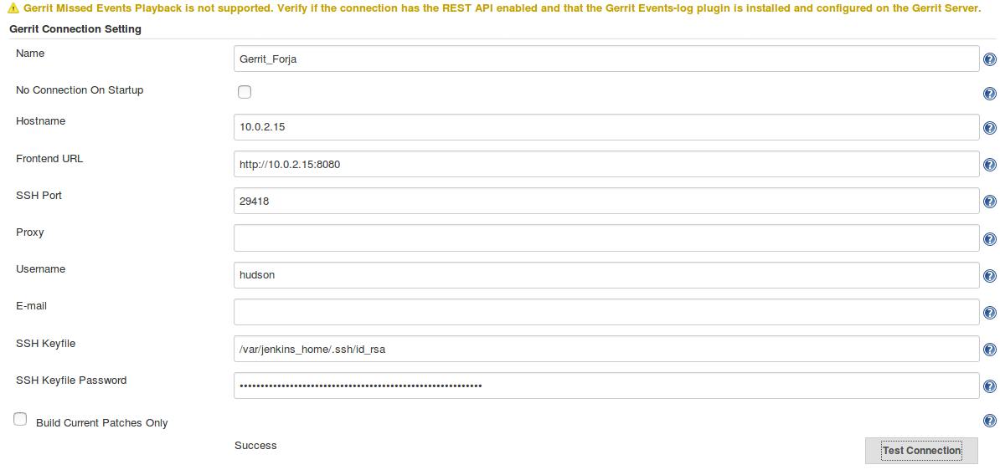
	 
   Configuración de la conexión Jenkins-Gerrit 

Creación de credenciales
^^^^^^^^^^^^^^^^^^^^^^^^

Para interactuar con Git y Gerrit, Jenkins necesita almacenar los credenciales para conectar con el servicio Gerrit.

En Jenkins, Credentials->global->Add Credentials->Kind->SSH Username with private key

Antes hay que averiguar la clave privada ssh de jenkins.

Para ello, conectarse al contenedor de Jenkins e imprimir la clave id_rsa.

.. code:: bash
	  
	  docker exec $(docker ps | grep jenkins| cut -d' ' -f1) \
	                                 cat /var/jenkins_home/.ssh/id_rsa
	  

Ver imagen:

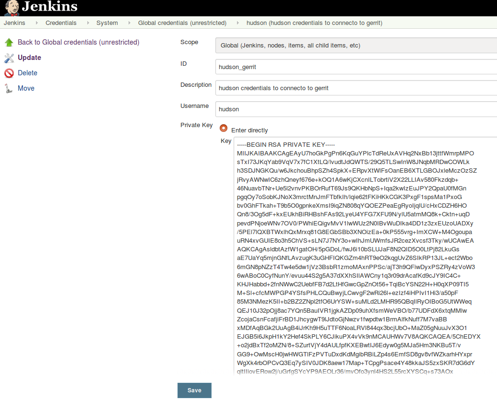
	 
   Configuración de los credenciales Jenkins-Gerrit 

Credenciales de Docker
^^^^^^^^^^^^^^^^^^^^^^

Para publicar imágenes docker es necesario autenticarse en el registro. Usaremos Docker HUB.
El plugin de docker para Jenkins facilita la tarea.

Manage Jenkins->Configure System->Pipeline Model Definition->Registry Credentials

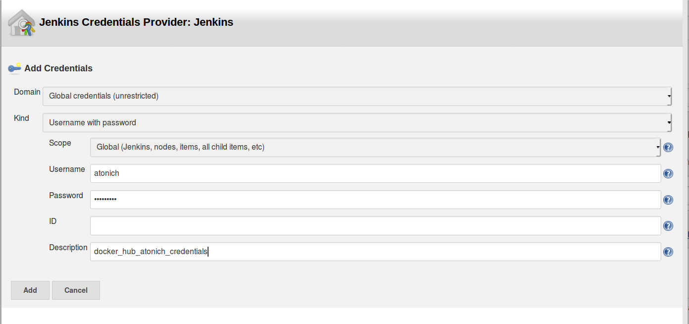
	 
   Configuración de los credenciales Docker Hub

   
Configuracion Gerrit
--------------------

Usuario hudson
^^^^^^^^^^^^^^

Es necesario dar de alta la clave ssh publica de jenkins para que este se pueda connectar

Settings->SSH Keys->New SSh key

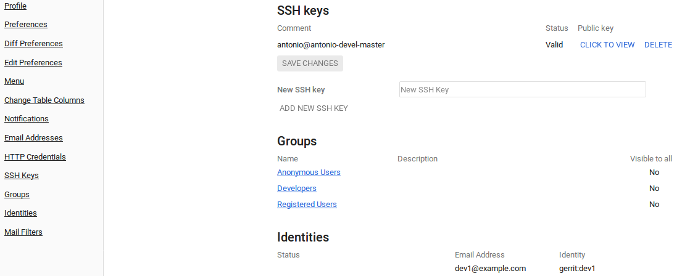
	 
   Configuración de la clave publica de jenkins en Gerrit

Creación del repositorio tic-tac-toe
^^^^^^^^^^^^^^^^^^^^^^^^^^^^^^^^^^^^

Entrar como *admin* luego:

Browse->Repositories->CREATE NEW

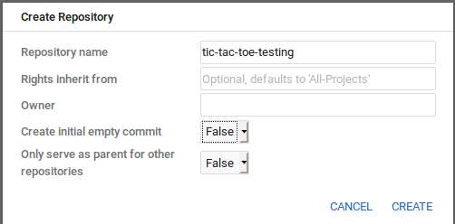
	 
   Creación del repositorio en Gerrit

Configurar los permisos prohibiendo mergear en *heads* y permitiendo a los *developers* hacer revision de código y mezclar.

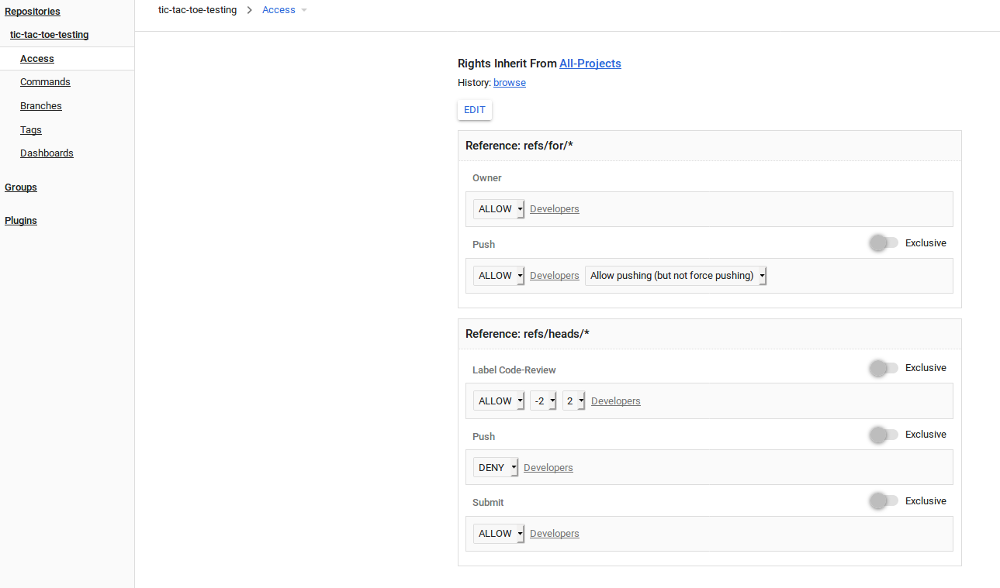
	 
   Configurar permisos en el repositorio.

	    
Iniciar el repositorio
^^^^^^^^^^^^^^^^^^^^^^

Esto se puede hacer de diversas formas. Pidiendo a Gerrit que cree el commit inicial, clonando y copiando los archivos del proyecto para añadirlos a un segundo commit ya con nuestro código.

O como lo vamos a hacer aquí en el que no tendremos ese commit inicial vacío.

Partiendo de un directorio que contiene el código fuente de tic-tac-toe-testing. Borrar el directorio *.git* si es que ya existía. Esto no es estricamente necesario, podríamos tener un repositorio con dos remotos, gitHub y nuestro gerrit por ejemplo, pero por simplicidad, trabajaremos solo nuestro Gerrit.

.. code:: bash

   cd tic-tac-toe-testing
   git init
   git remote add origin ssh://antonio@gerrit:29418/tic-tac-toe-testing

   git remove -v
   origin	ssh://antonio@gerrit:29418/tic-tac-toe-testing (fetch)
   origin	ssh://antonio@gerrit:29418/tic-tac-toe-testing (push)

   git branch --set-upstream-to=origin/master master
	  
   gitdir=$(git rev-parse --git-dir)
    scp -p -P 29418 antonio@10.0.2.15:hooks/commit-msg ${gitdir}/hooks/

   git add -A && git commit -m "Add base source code"
	  
   ssh -p 29418 localhost gerrit review --code-review +2 --submit $(git rev-parse HEAD)

Integración de SonarQube en la forja
------------------------------------

Levantar el servicio
^^^^^^^^^^^^^^^^^^^^

Se ha creado un script que levanta el servicio con el mismo estilo que el resto de servicios de la forja con los siguientes parámetros añadidos al fichero *config.rc*

.. code:: bash

    SONARQUBE_NAME=sonarqube
    SONARQUBE_VOLUME=sonarqube-volume
    SONARQUBE_IMAGE_NAME=sonarqube:6.7-community
    SONARQUBE_PORT=8686
    
El código del script *createSonarQube.sh*

.. code:: bash

    #!/bin/bash -x
    set -e

    . config.rc

    # Create SonarQube volume.
    docker volume create --name ${FORGE_PREFIX}-${SONARQUBE_VOLUME}

    # Start Jenkins.
    docker run \
    --name ${FORGE_PREFIX}-${SONARQUBE_NAME} \
    --net ${CI_NETWORK} \
    -p ${SONARQUBE_PORT}:9000 \
    --volume ${FORGE_PREFIX}-${SONARQUBE_VOLUME}:/opt/sonarqube \
    --detach ${SONARQUBE_IMAGE_NAME}

Es buena idea modificar el script *start.sh* para que la siguiente vez que se cree la forja levante tambien SonarQube. No es neceario modificar el resto de scripts *resume.sh*, *stop.sh* o *remove.sh*.

.. code:: bash

    diff --git a/start.sh b/start.sh
    index f7240ca..e17b099 100755
    --- a/start.sh
    +++ b/start.sh
    @@ -43,6 +43,9 @@ done
     # Launching Self Service Password
     ./createLDAPSSP.sh

    +# Launching SonarQube
    +./createSonarQube.sh
    +
     echo "##################"
     echo "###    Done    ###"
     echo "##################"
    @@ -55,3 +58,4 @@ echo "Archiva               -> http://${PUBLIC_IP}:${ARCHIVA_PORT}"
     echo "phpLDAPadmin          -> http://${PUBLIC_IP}:${PHPLDAPADMIN_PORT}/phpldapadmin"
     echo "Self Service Password -> http://${PUBLIC_IP}:${LDAPSSP_PORT}/ssp"
     echo "Apache Service        -> http://${PUBLIC_IP}:${HTTPD_PORT}"
    +echo "SonarQube             -> http://${PUBLIC_IP}:${SONARQUBE_PORT}"

En esta forja no se ha creado una base de datos dedicada para SonarQube y se usa la que trae integrada el propio contenedor. Esto no es suficiente para entornos de producción.
Para este tipo uso se podría seguir la misma aproximación que en el script createGerrit.sh en el que se crea un contenedor de PostGress con su base de datos.

Usuario en SonarQube
^^^^^^^^^^^^^^^^^^^^

En la imagen oficial nos podemos logear con *admin/admin*. La primera vez que entramos se generará un token que podemos usar para autenticar los análisis.

SonarQube Scanner plugin para Maven
^^^^^^^^^^^^^^^^^^^^^^^^^^^^^^^^^^^

En los jobs se usa *Maven* desde contenedores de la imagen docker oficial. Es necesario instalar el plugin de sonarQube como una dependencia más.

Para ello crear el siguiente fichero en el host.

$HOME/.m2/settings.xml

.. code:: xml

    <settings>
      <pluginGroups>
	<pluginGroup>org.sonarsource.scanner.maven</pluginGroup>
      </pluginGroups>
      <profiles>
	<profile>
	  <id>sonar</id>
	  <activation>
	    <activeByDefault>true</activeByDefault>
	  </activation>
	  <properties>
	    <!-- Optional URL to server. Default value is http://localhost:9000 -->
	    <sonar.host.url>
	      http://10.0.2.15:8686
	    </sonar.host.url>
	  </properties>
	</profile>
      </profiles>
    </settings>

Luego para usarlo basta con lanzar un docker como el que sigue:

.. code:: bash

   docker run --rm \
     -v $HOME/.m2:/root/.m2 \
     -v codeurjc-forge-jenkins-volume:/src \
     -w /src/workspace/\$JOB_NAME \
     maven:3.6.1-jdk-8 \
     /bin/bash -c "mvn package sonar:sonar \
        -DskipTests \
        -Dsonar.host.url=http://10.0.2.15:8686 \
        -Dsonar.login=33ed0bb27ac337c11941d22aeaf32f6d80bfe0ae"'''  
    
    
SonarQube Scanner para Jenkins
^^^^^^^^^^^^^^^^^^^^^^^^^^^^^^

Es un plugin que habilita la integración con Jenkins, es capaz de exponer variables de entorno útiles para reportar análisis,
ya tambien para interpretar los resultados de estos análisis.

Instalación:

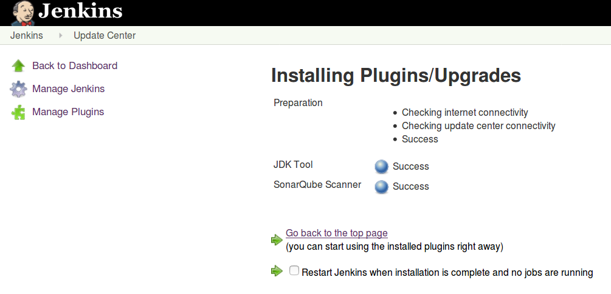
	 
   Instalar SonarQube Scanner y reiniciar

En Mange Jenkins->Configure System->SonarQube servers, configurar el servicio de SonarQube de la forja.

   
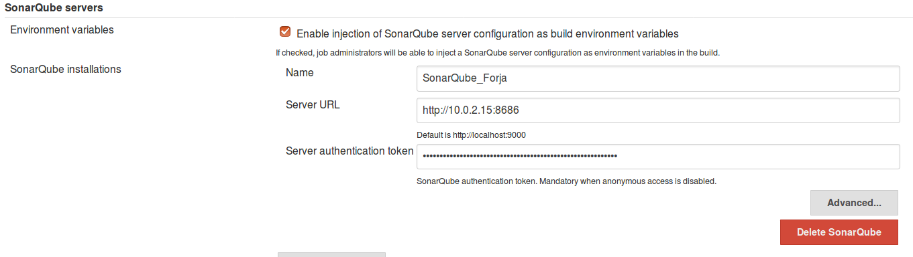
	 
   Dar de alta SonarQube en Jenkins

Uso en el pipeline:
	    
.. code:: groovy

    stage('SonarQube analysis'){
      withSonarQubeEnv {
	sh '''docker run --rm \
	  -v $HOME/.m2:/root/.m2 \
	  -v codeurjc-forge-jenkins-volume:/src \
	  -w /src/workspace/\$JOB_NAME \
	  maven:3.6.1-jdk-8 \
	  /bin/bash -c "mvn clean package \$SONAR_MAVEN_GOAL \
	  -DskipTests \
	  -Dsonar.host.url=\$SONAR_HOST_URL \
	  -Dsonar.login=33ed0bb27ac337c11941d22aeaf32f6d80bfe0ae"'''
       }
       archiveArtifacts 'target/sonar/report-task.txt'
    }

	  

Editor de version para Maven Projects
-------------------------------------

Habrá varios jobs que necesitan leer y actualizar el número de version del projecto Maven.
La solución para editar propuesta en los apuntes de la asignatura es usar *sed* pero particularmente no la considero la más apropiada para editar ficheros con formato xml.

Así pues he buscado utilidades que asistan en el manejo del *pom.xml*. He encontrado algunas para la lectura y otras para la escritura. Sin embargo todas ellas requieren que para dar respuesta a los requisitos de la practica se combinen con algún programa que soporte expresiones regulares y transformacion de cadenas de carácteres cmo *sed*, *grep*, *awk*. Esto en sí no es malo, pero ya require un poco de desarrollo propio.

Particularmente me resulta más cómodo hacer un programita en python. En Internet ya existen algunos que se pueden usar de base y modificar para que hagan lo que requieren los requisitos.

En realidad el argumento de más fuerza para realizar el desarrollo en python ha sido que se parece mucho a lo que tenemos en producción en la empresa y presenta a pequeña escala los mismos problemas que nuestro entorno de CI. Estoy usando este trabajo como prueba de concepto para solventar los grandes problemas de dependencias entre código propio, distintas versiones de librerías de terceros y ramas antiguas. Creo que crear imagenes docker nos puede ayudar con la mantenibilidad del entorno. Actualmente hay una persona asignada un año entero a transformar scripts en python2 a python3. Con soluciones de este tipo podríamos ahorrar mucho esfuerzo. Justifico de esta forma el "Matar moscas a cañonazos" y no usar maven *help:version* y demás utilidades.

Se ha desarrollado una pequeña utilidad en python para realizar las operaciones de lectura y actualización de la version del proyecto en fichero pom.xml

tic-tac-toe-testing/continous_integration/pom_version_updater/pom_version_updater.py

.. code:: python

    #! /usr/bin/env python
    #
    # coding: utf-8
    """
    version updater script for Maven projects.
    Reads pom.xml, parses the version, increments it and writes an
    updated pom to stdout.

    Usage:
	pom-version-updater.py [-i][-r] [-v <new version number>] [path to pom.xml]

    Options:
	-r  readversion: just prints the version number without suffix
	-i  Edit pom.xml in place, instead of writing result to stdout
	-c  confirm current version. Removes suffix.
        -v  specify a version number, e.g. "1.23".
                                  It will add a suffix if not provided

    If pom.xml file is not specified, the script will look in the
    current working directory.

    Tested with Python 2.7.5 and 3.7.
    Requires lxml.
    """
    import sys
    import getopt
    import os.path
    from lxml import etree as ET

    SUFFIX = "-SNAPSHOT"

    class InvalidVersion(Exception):
	def __init__(self, msg):
	    self.msg = msg
	def __str__(self):
	    return "Invalid version: " + self.msg

    def main(args):
	version_to_write = None
	in_place = False
	readversion = False
	remove_suffix = False
	pom_xml = './pom.xml'

	try:
	    opts, args = getopt.getopt(
		args, 'rv:ich', ['readversion', 'version',
				 'inplace', 'remove_suffix' ,'help'])
	except getopt.GetoptError:
	    usage()
	    return False

	for opt, value in opts:
	    if opt in ('-h', '--help'):
		usage()
		return False
	    elif opt in ('-v', '--version'):
		version_to_write = add_suffix_to_version(value)
	    elif opt in ('-i', '--inplace'):
		in_place = True
	    elif opt in ('-r', '--readversion'):
		readversion = True
	    elif opt in ('-c', '--remove_suffix'):
		remove_suffix = True
	    else:
		usage()
		return False

	if len(args) > 0:
	    pom_xml = args[0]
	if not os.path.isfile(pom_xml):
	    log("ERROR: Could not find pom.xml file: %s" %pom_xml)
	    usage()
	    return False

	try:
	   bump(pom_xml, version_to_write,
	        in_place, readversion, remove_suffix)
	    return True
	except InvalidVersion as e:
	    log(e)
	    return False

    def usage():
	print(__doc__)

    def add_suffix_to_version(value):

	retval = value
	if not value.endswith(SUFFIX):
	    retval =  value + SUFFIX
	return retval

    def remove_suffix_from_version(value):

	if value.endswith(SUFFIX):
	    return value.split(SUFFIX)[0]
	return value

   def bump(pom_xml, version_to_write,
	    in_place, readversion, remove_suffix):

	parser = ET.XMLParser(remove_comments=False)
	xml = ET.parse(pom_xml, parser=parser)

	# Find the project's current version
	version_tag = xml.find("./{*}version")
	if version_tag == None:
	    raise InvalidVersion(
		"pom.xml does not appear to have a <version> tag")
	current_version = version_tag.text

	# If dry run, just print the next version and exit
	if readversion:
	    print(remove_suffix_from_version(current_version))
	    return

	# update version by removing suffix
	if remove_suffix:
	    version_to_write = remove_suffix_from_version(current_version)

	# Update the XML
	version_tag.text = version_to_write

	if in_place:
	    # Write back to pom.xml
	    write_xml_to_file(xml, pom_xml)
	else:
	    # Print result to stdout
	    print_xml(xml)

    def write_xml_to_file(xml, output_file):
	with open(output_file, 'wb') as f:
	    f.write(ET.tostring(
		xml, encoding="utf-8", xml_declaration=True))

    def print_xml(xml):
	result = ET.tostring(
	    xml, encoding="utf-8", xml_declaration=True)
	if sys.hexversion >= 0x03000000:
	    # Python 3.x
	    sys.stdout.buffer.write(result)
	else:
	    # Python 2.x
	    print(result)

    def log(msg):
	sys.stderr.write(str(msg) + '\n')

    if __name__ == '__main__':
	sys.exit(not main(sys.argv[1:]))

Este script de python habrá de ejecutarse en jobs de jenkins para actualizar y leer ficheros pom.xml, pero tiene varias dependencias que el entorno de ejecución de jenkins
no sabrá satisfacer correctamente, como por ejemplo python 3.7 y la dependia lxml. Como hemos visto en la asignatura docker nos ayuda a resolver dependencias dentro de un
entorno de ejecución. Se ha creado por tanto una image docker que satisface dichas dependencias.

Imagen docker para python y lxml
^^^^^^^^^^^^^^^^^^^^^^^^^^^^^^^^

Existe una imagen docker oficial de python que se usará como base para ejecutar python, y sobre ella se añadirá la dependencia lxml que a su vez necesita un entorno de compilación
c++ para poder ser instalada.

Por tanto se ha creado *tic-tac-toe-testing/continous_integration/pom_version_updater/python_enviroment_image/Dockerfile* partiendo de una version python alpine para optimizar el espacio en disco:

.. code:: bash

    FROM python:3.7-alpine

    RUN apk add --update --no-cache --virtual .build-deps \
	    g++ \
	       python-dev \	
	       libxml2 \	
	       libxml2-dev && \
	       apk add libxslt-dev && \
	       pip install --no-cache-dir lxml && \
	       apk del .build-deps	  

La construimos y subimos a docker hub para que pueda ser usada en Jenkins directamente

.. code:: bash

   cd
   docker build -t atonich/python3-lxml:latest .

   docker login
   docker push atonich/python3-lxml:latest
     ...
     latest: digest: sha256:2065dbb138f9dade308678 ...
   docker logout

   cd ..
   docker run --rm -v $PWD/:/app -w /app atonich/python3-lxml \
	  sh -c "python3 pom-version-updater.py -h"

      version updater script for Maven projects.
      Reads pom.xml, parses the version, increments ...

      Usage:
	  pom-version-updater.py [-i][-r] [-v <new version number>] [path to pom.xml]
      ...
  
Job de commit, tic-tac-toe-commit-scm
-------------------------------------

El job *tic-tac-toe-commit-scm* es de tipo Pipeline, tiene configurado el trigger con gerrit events.
Es ejecutado cada vez que se sube un parche a Gerrit. Lanza los tests unitarios y de integración utilizádose para verificar el parche.

Limitar el tamaño de disco
^^^^^^^^^^^^^^^^^^^^^^^^^^

Para evitar que la historia de este job ocupe mucho espacio es disco es recomendable borrar builds antiguas automaticamente.
Los valores dependerán del proyecto y los recursos disponibles. Para este job la historia queda limitada a 10 ejecuciones.

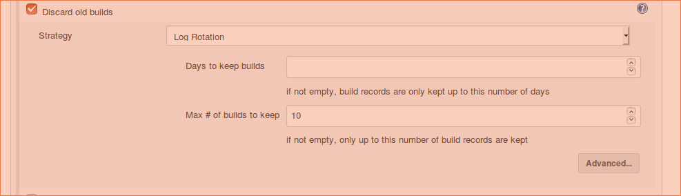
	 
   Historia limitada a 10 ejecuciones

Trigger, Gerrit Event
^^^^^^^^^^^^^^^^^^^^^

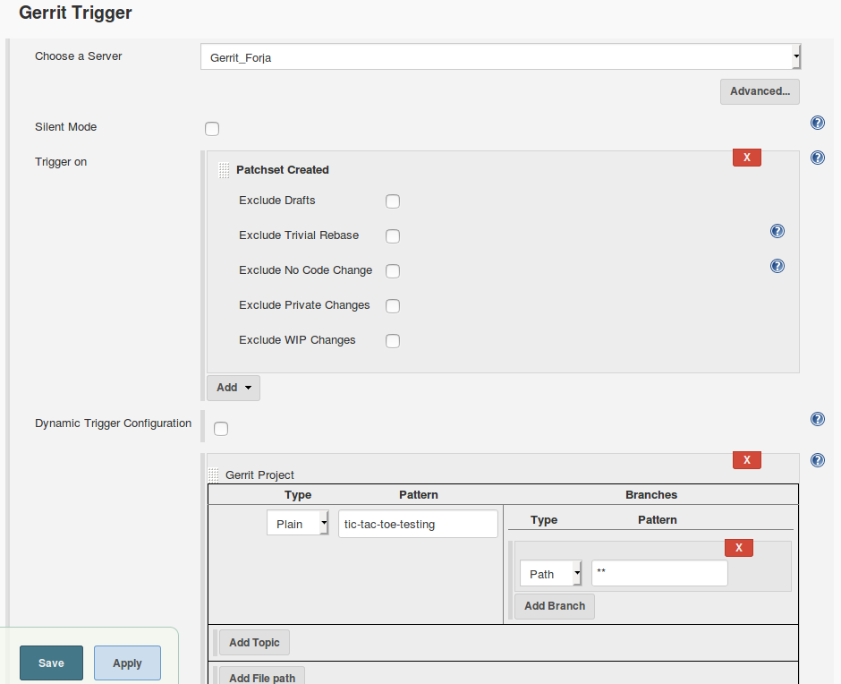
	 
   Configurar Gerrit Trigger en commit job para cualquier rama

Pipeline script from SCM configuration
^^^^^^^^^^^^^^^^^^^^^^^^^^^^^^^^^^^^^^

Para ejecutar un jenkinsfile incluido en el repositorio bajo test es necesario configurar el job como en la imagen. Así descargará la version del script del job
como está en la version del cambio en gerrit y lo ejecutará.

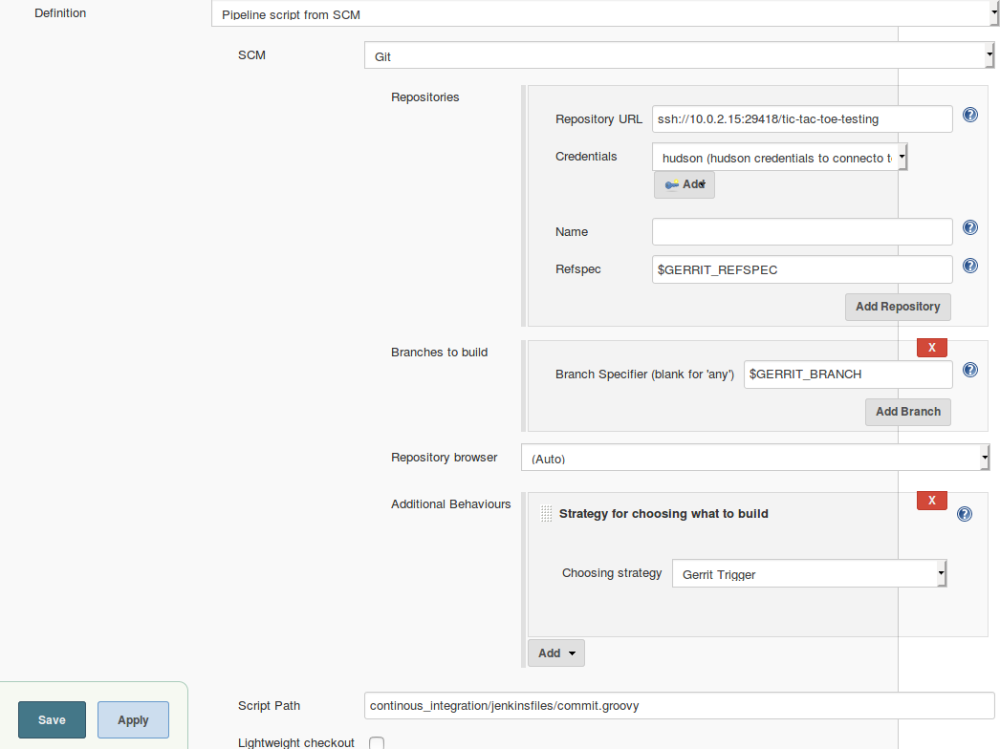
	 
   Descargar el script del job del cambio del cambio en gerrit

Limpiar espacio de trabajo
^^^^^^^^^^^^^^^^^^^^^^^^^^

Cuando se hacen jobs de Jenkins hay que pensar en como dejar el directorio de trabajo para que la siguiente ejecución sea ópima y exitosa. Lo más limpio sería empezar con espacio vació, sin embargo tendríamos que descargar el repositorio de Git siempre desde cero, lo que no es óptimo, por el plugin de Git para Jenkins tiene lógica para aprovechar clonados anteriores y hacer descargas diferenciales. Por todo esto la opción más recomendable es borrar todo aquello que no sea de Git, lo que hace forma cómoda el comando:

.. code:: bash

	  git clean -dfx

Jenkinsfile
^^^^^^^^^^^

Código del pipeline del job

.. code:: groovy

    node {
	stage('Preparation') {
	    // Fetch the changeset to a local branch using the build parameters 
	    // provided to the build by the Gerrit plugin...
	    checkout(
		[$class: 'GitSCM', branches: [[name: '$GERRIT_BRANCH']],
		 doGenerateSubmoduleConfigurations: false,
		 extensions: [[$class: 'BuildChooserSetting',
			       buildChooser: [$class: 'GerritTriggerBuildChooser']]],
		 submoduleCfg: [],
		 userRemoteConfigs: [
		            [credentialsId: 'hudson_gerrit',
			     refspec: '$GERRIT_REFSPEC',
			     url: 'ssh://10.0.2.15:29418/tic-tac-toe-testing']]
		]
	    )
	}
	try {
	    stage('Build') {
		// Run the build
		sh '''docker run --rm \
			-v $HOME/.m2:/root/.m2 \
			-v codeurjc-forge-jenkins-volume:/src \
			-w /src/workspace/\$JOB_NAME \
			maven:3.6.1-jdk-8 \
			/bin/bash -c "mvn package -DskipTests"'''
	    }
	    stage('Test') {
		// Run the Tests
		sh '''docker run --rm \
			-v $HOME/.m2:/root/.m2 \
			-v codeurjc-forge-jenkins-volume:/src \
			-w /src/workspace/\$JOB_NAME \
			maven:3.6.1-jdk-8 \
		        /bin/bash -c \
		            "mvn test -Dtest=BoardTest*,TicTacToeGameTest.java"'''
	    }
	}
	catch (exc){
	    echo 'Build Failed'
	    currentBuild.result = 'FAILURE'
	}
	finally {
	    stage('Result'){
		junit 'target/**/*.xml'
	    }
	    sh 'git clean -dfx'
	}
    }

Job de merge, tic-tac-toe-merge-scm
-------------------------------------

El job *tic-tac-toe-merge-scm* es de tipo Pipeline, tiene configurado el trigger con el evento de *submit* en el repositorio de gerrit .
Es ejecutado cada vez que se mergea un commit en cualquier rama. Lanza los tests unitarios y de sistema guardando los artefactos de test. Publica el código en sonarQube y sube una imagen a Docker Hub.

¡Además es capaz de añadir la información de commit en SonarQube para aumentar trazabilidad!

Tests de sistema: de WebDriver a TestContainters
^^^^^^^^^^^^^^^^^^^^^^^^^^^^^^^^^^^^^^^^^^^^^^^^

Es un proceso aparentemente sencillo pero realmente complicado si no tienes experiencia en Java y TestContainers. Aprender la tecnología de testcontainer es complejo. Desde qué versión usar a
aprender como encontrar, depurar y solucionar la miriada de errores que aparecen, lleva muchas horas de trabajo. 

La versión de TestContainers 1.7 que aparece en otros ejemplos de la asignatura no funciona. Posiblemente porque usa la tag latest de contenedores auxiliares como el de VNC.
En la versión 1.11.1 aparece solventado este problema, ahora se usa una tag más específica para los todos los contenedores auxiliares.

Para poder usar TestContainers en el proyecto, añadir al *pom.xml* la siguientes dependencias.

.. code:: xml

   <dependency>
     <groupId>org.testcontainers</groupId>
     <artifactId>testcontainers</artifactId>
     <version>1.11.1</version>
   </dependency>
   <dependency>
     <groupId>org.testcontainers</groupId>
     <artifactId>selenium</artifactId>
     <version>1.11.1</version>
   </dependency>    

Hay un error en TestContainters que hace que deje de funcionar tras haber levantado  contenedores un número de veces. No se puedan iniciar más contenedores porque no puede asignar una red.
Limpiando las redes vuelve a funcionar, pero desconozco la razón ráiz de este error, debe ser un bug en el contenedor Ryuk.

Si esto ocurre ejecutar este comando para borrar las redes no usadas por al menos un contenedor. ¡No ejecutar con la forja parada!

.. code:: bash

   docker network prune

 
Test Stage
^^^^^^^^^^

En esta fase del job se lanzan los test unitarios y de sistema, publicando los resultados como junit y guardando los videos de los test de sistema como artefactos.

La aplicación corre dentro de un contenedor *Maven* por lo que hay que exponer el puerto donde escucha al host. Es necesario cambiar el puerto por defecto de Spring pues
este es usado por gerrit, se ha cambiado el código de la aplicación para permitirlo. La url de los test ya no puede ser localhost porque los *browser* corren dockerizados
por *TestContainers*, por tanto la url donde alcanzar la aplicación se pasa como una propiedad a la JVM, APP_URL.

el comando de docker para lanzar los test es:

.. code:: groovy

   stage('Test') {
   // Run the build
   sh '''docker run --rm \
   -v /var/run/docker.sock:/var/run/docker.sock \
   -v $HOME/.m2:/root/.m2 \
   -v codeurjc-forge-jenkins-volume:/src \
   -w /src/workspace/\$JOB_NAME \
   -p 7070:7070 \
   maven:3.6.1-jdk-8 \
   /bin/bash -c "mvn test -DAPP_URL=http://10.0.2.15:7070/"'''
   }

Como resultado de esta fase archivan los resultados de test en formato *junit* y los videos de los test de sistema en formato *flv*.
   
SonarQube analysis Stage
^^^^^^^^^^^^^^^^^^^^^^^^

Se Analiza la calidad del código con SonarQube, publicando los resultados del análisis en este servicio.

Para ello:

.. code:: groovy 

   stage('SonarQube analysis'){
     withSonarQubeEnv {
       sh '''docker run --rm \
         -v $HOME/.m2:/root/.m2 \
	 -v codeurjc-forge-jenkins-volume:/src \
	 -w /src/workspace/\$JOB_NAME \
	 maven:3.6.1-jdk-8 \
	 /bin/bash -c "mvn clean package \$SONAR_MAVEN_GOAL \
	   -DskipTests \
	   -Dsonar.host.url=\$SONAR_HOST_URL \
	   -Dsonar.login=33ed0bb27ac337c11941d22aeaf32f6d80bfe0ae"'''
     }
   ...

Este código es capaz de mandar a analizar y publicar el resultado en el servidor.
 
Añadiendo información del commit a SonarQube
""""""""""""""""""""""""""""""""""""""""""""

En el servidor de SonarQube se pierde toda información de Git, lo que dificulta la trazabilidad. Para mejorar esta trazabilidad,
se creará un evento de tipo *OTHER* asociado a cada análisis usando el WEB API de SoarQube.

Para ello primero hay que asegurar que pipeline espera a que el análisis termina usando el plugin de SonarQube (waitForQualityGate()):

.. code:: groovy
	  
  //sleep needed due to a bug in waitForQualityGate waiting forever without it
  sleep(10)
  // Just in case something goes wrong, pipeline will be killed after a timeout	  
  timeout(time: 1, unit: 'HOURS') { 
    def qg = waitForQualityGate() // This directive uses the taskId file
    if (qg.status != 'OK') {
	  error "Pipeline aborted due to quality gate failure: ${qg.status}"
    }
  }
	  

Tras finalizar el análisis primero se hace una query para conseguir el *analysisId*, parámetro necesario para asignar la etiqueta con el commit a análisis correcto.
Todo esto ha quedado encapsulado en un script que hace las veces de cliente de la Web API de sonarQube.

Código del pipeline que reporta el commit:

.. code:: groovy

   withSonarQubeEnv {
     sh '''./continous_integration/sonarqube/event_create_api_rest.sh \
       -v --sq-url \$SONAR_HOST_URL \
       --sq-report target/sonar/report-task.txt \
       --git-ref \$GERRIT_PATCHSET_REVISION'''
   }
   archiveArtifacts 'target/sonar/report-task.txt'

Código del cliente:

.. code:: bash
   
    #!/bin/bash

    set -x

    SONARQUBE_URL=""
    ANALYSIS_ID=""
    GIT_REF=""
    TASKDETAILS=task_details.json

    usage()
    {
    cat <<EOF
	usage: $0 --sq-report <file> --sq-url <url> --git-ref <git reference> [options]

	This script starts the dp-raf flow for Heuristics Releases

	Mandatory:
	--sq-report          path to sonarQube report file (report-task.txt)
	--sq-url             typicaly http://localhost:9000
	--git-ref            Git reference: commit-id, tag

	 Options:
	-h/--help                   Show this message.
	-v                          Be verbose.
    EOF
	return 0
    }

    function parseArguments()
    {
	OPTS=`getopt -o hv -l help,sq-report:,sq-url:,git-ref: -- "$@"`

	eval set -- "$OPTS"

	while [ $# -gt 0 ]
	do
	    case $1 in
		-h | --help)
		    usage
		    exit 0
		    ;;
		--sq-report)
		    SONARQUBE_REPORT=$2
		    shift; shift
		    ;;
		--sq-url)
		    SONARQUBE_URL=$2
		    shift; shift
		    ;;
		--git-ref)
		    GIT_REF=$2
		    shift; shift
		    ;;
		-v)
		    BE_VERBOSE='y'
		    set -x
		    shift;
		    ;;
		--)
		    shift
		    break
		    ;;
		(-*)
		    echo "$0: unrecognized option $1" 1>&2
		    exit 1
		    (*)
		    break
		    ;;
	    esac
	done
	return 0
    }

    function getTaskDetails ()
    {

	[[ -f "${TASKDETAILS}" ]] && rm "${TASKDETAILS}"
	wget ${ceTaskUrl} -O "${TASKDETAILS}"
	return $?
    }

    function getAnalysisID ()
    {
        local analysis_id=`python -c "import json; fd=open('"${TASKDETAILS}"'); \
                                      answer=json.loads(fd.readline()); \
	                              print answer['task']['analysisId']; fd.close()"`

        [[ -z "$analysis_id" ]] && echo "AnalysisId not found" && \
                                               cat "${TASKDETAILS}" && return 1;
	echo ${analysis_id}
	return 0
    }

    #####################
    #### MAIN METHOD ####
    #####################
    parseArguments $@

    source ${SONARQUBE_REPORT}
    getTaskDetails
    ANALYSIS_ID=$(getAnalysisID)

    curl \
      -i -X "POST" -u admin:admin \
       ${SONARQUBE_URL}/api/project_analyses/create_event?analysis=${ANALYSIS_ID}\&\
                                                           category=OTHER\&name=${GIT_REF}

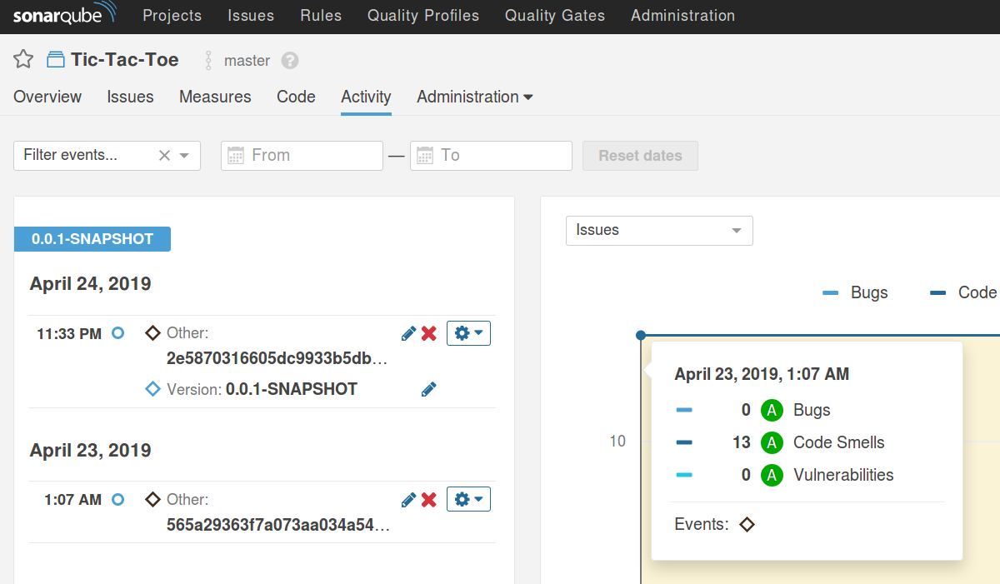
	 
   Vista de la trazabilidad por commit en SonaQube

Añadir información del commit en la aplicación
^^^^^^^^^^^^^^^^^^^^^^^^^^^^^^^^^^^^^^^^^^^^^^

Podemos aprovechar los plugins para el proyecto java *Git Commit Plugin* y *Spring Boot Actuator*.

Instalar *Git Commit Plugin*:

.. code:: xml

   <plugin>
	  <groupId>pl.project13.maven</groupId>
	  <artifactId>git-commit-id-plugin</artifactId>
   </plugin>

Para instalar y usar *Spring Boot Actuator* habrá que añadir la dependencia al *pom.xml*:

.. code:: xml

   <dependency>
	  <groupId>org.springframework.boot</groupId>
	  <artifactId>spring-boot-starter-actuator</artifactId>
   </dependency>

Así basta con empaquetar dentro del repositorio de GIt con *mvn package* y tendremos como resultado algo como lo que muestra la siguiente figura en el recurso /info
   
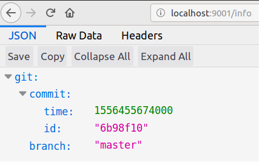
	 
   Ejemplo de la trazabilidad de git desde el API REST

   
   
Publish Docker Image Stage
^^^^^^^^^^^^^^^^^^^^^^^^^^

Este job  genera una imagen Docker en la que se incluye como label el identificador del commit para facilitar la trazabilidad.
Se publicará la imagen en DockerHub con el tag dev en repositorio *tic-tac-toe-testing* del usuario *Atonich*.

Enlace al repositorio `atonich/tic-tac-toe-testing <https://cloud.docker.com/repository/docker/atonich/tic-tac-toe-testing>`_.

Si queremos levantar el *.jar del proyecto es necesario especificar donde está el main del proyecto en un fichero *Manifest*. Afortunadamente el
framework Spring puede ayudar en esta tarea agregando un plugin. Basta con añadir lo siguiente al *pom-xml*:

.. code:: xml

   <plugin>
     <groupId>org.springframework.boot</groupId>
     <artifactId>spring-boot-maven-plugin</artifactId>
     <version>1.5.9.RELEASE</version>
     <executions>
       <execution>
	 <goals>
	   <goal>repackage</goal>
	 </goals>
       </execution>
     </executions>
   </plugin>
	

   
Creación de la imagen. Se ha creado un script para construir la imagen docker incluyendo *labels*.

build-image-with-tag.sh:

.. code:: bash

    #!/bin/bash

    set -x

    TAG=$1

    docker build \
	   --build-arg GIT_COMMIT=$(git rev-parse HEAD) \
           --build-arg COMMIT_DATE=$(git log -1 \
                                  --format=%cd --date=format:%Y-%m-%dT%H:%M:%S) \
	   -t atonich/tic-tac-toe-testing:$TAG .

Dockerfile:

.. code:: bash

    FROM openjdk:8-jre

    ARG GIT_COMMIT=unspecified
    LABEL git_commit=$GIT_COMMIT

    ARG COMMIT_DATE=unspecified
    LABEL commit_date=$COMMIT_DATE

    COPY *.jar /usr/app/app.jar
    WORKDIR /usr/app
    CMD [ "java", "-jar", "app.jar" ]

Las imágenes contruidas así contendrán etiquetas documentando su reación con el repositorio de git.
Es siguiente comando da el contexto de la imagen:

.. code:: bash

   docker inspect --format "{{ .Config.Labels }}" \
	  atonich/tic-tac-toe-testing:dev

   map[commit_date:2019-04-26T00:30:23 git_commit:547fdcc906bbbe0f84d...]

Código de su uso en el pipeline en jenkins:

.. code:: groovy

   stage('Docker Image') {
     withDockerRegistry(credentialsId: 'atonich_dockerhub') {
        sh ''' mv target/*.jar continous_integration/build/'''
	sh ''' cd continous_integration/build && ./build-image-with-tag.sh dev'''
	sh ''' docker push atonich/tic-tac-toe-testing:dev'''
     }
   }

El contexto *withDockerRegistry* se encarga de autenticarse en el registro publico *Docker Hub* con los credenciales que fueron previamente configurados. 

Por supuesto hay más formas de hacer esto usando el plugin de docker para jenkins.

Job completo
^^^^^^^^^^^^^^

Configuración del disparador del job.

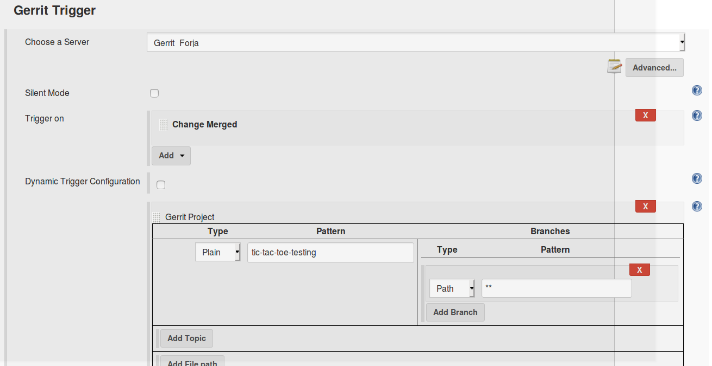
	 
   Configuración del disparador de merge.

El código del pipeline de job completo:

.. code:: groovy

    node {
	stage('Preparation') {
	    checkout(
		[$class: 'GitSCM', branches: [[name: '$GERRIT_BRANCH']],
		 doGenerateSubmoduleConfigurations: false,
		 extensions: [
		     [$class: 'BuildChooserSetting',
		      buildChooser: [$class: 'GerritTriggerBuildChooser']]],
		 submoduleCfg: [],
		 userRemoteConfigs: [
		      [credentialsId: 'hudson_gerrit',
		       refspec: '$GERRIT_REFSPEC',
		       url: 'ssh://10.0.2.15:29418/tic-tac-toe-testing']]
		]
	    )
	}
	try {
	    stage('Test') {
		// Run the build
		sh '''docker run --rm \
		      -v /var/run/docker.sock:/var/run/docker.sock \
		      -v $HOME/.m2:/root/.m2 \
		      -v codeurjc-forge-jenkins-volume:/src \
		      -w /src/workspace/\$JOB_NAME \
		      -p 7070:7070 \
		      maven:3.6.1-jdk-8 \
		        /bin/bash -c \
		           "mvn test -DAPP_URL=http://10.0.2.15:7070/"'''
	    }
	    stage('SonarQube analysis'){
		withSonarQubeEnv {
		    sh '''docker run --rm \
		      -v $HOME/.m2:/root/.m2 \
		      -v codeurjc-forge-jenkins-volume:/src \
		      -w /src/workspace/\$JOB_NAME \
		      maven:3.6.1-jdk-8 \
		      /bin/bash -c "mvn clean package \$SONAR_MAVEN_GOAL \
			 -DskipTests \
			 -Dsonar.host.url=\$SONAR_HOST_URL \
			 -Dsonar.login=33ed0bb27ac337c11941d22aeaf32f6d80bfe0ae"'''
		}
		//sleep needed due to a bug in waitForQualityGate
		sleep(10)
		// Job will be killed after a timeout
		timeout(time: 1, unit: 'HOURS') {
		    def qg = waitForQualityGate() 
		    if (qg.status != 'OK') {
		       error "Pipeline aborted due to \
		              quality gate failure: ${qg.status}"
		    }
		}
		withSonarQubeEnv {
		  sh '''./continous_integration/sonarqube/event_create_api_rest.sh \
			  -v --sq-url \$SONAR_HOST_URL \
			  --sq-report target/sonar/report-task.txt \
		        --git-ref \$GERRIT_PATCHSET_REVISION'''
		}
		archiveArtifacts 'target/sonar/report-task.txt'
	    }
	    stage('Docker Image') {
		withDockerRegistry(credentialsId: 'atonich_dockerhub') {
		    sh ''' mv target/*.jar continous_integration/build/'''
		    sh ''' cd continous_integration/build && \
		                         ./build-image-with-tag.sh dev'''
		    sh ''' docker push atonich/tic-tac-toe-testing:dev'''
		}
	    }
	}
	catch (exc){
	    echo 'Build Failed'
	    currentBuild.result = 'FAILURE'
	}
	finally {
	    stage('Result'){
		archiveArtifacts 'target/*.flv'
		junit 'target/**/*.xml'
	    }

	    //clean up
	    sh 'git clean -dfx'
	    sh '''docker rmi $(docker images -f "dangling=true" -q)'''
	}
    }
	  

En jenkins se puede ver los enlaces al cambio en gerrit, el analásis en sonarQube, los resultados de los tests y los artefactos.

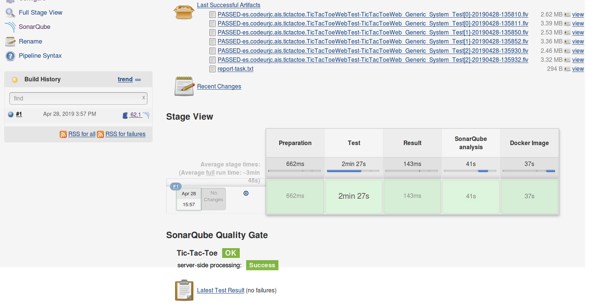
	 
   Ejemplo de ejecución exitosa.

Job de nightly, tic-tac-toe-nightly-scm
---------------------------------------

El job *tic-tac-toe-nightly-scm* es de tipo Pipeline, tiene configurado el trigger automatico tipo cron para que se ejecute todas las noches a las 1:00 am.
Primero ejecuta los tests unitarios y de sistema, si los pasa publica una image docker con el tag siguiendo el formato X.Y.Z.nightly.YYYYMMDD. Lanza los test de sistema contra la web ejecutando desde la imagen recien generada. Si los tests pasan, esa imagen se sube de nuevo a DockerHub con el tag “nightly”.

Disparador
^^^^^^^^^^

Configuración del disparador del job estilo *cron* que lo ejecutará en cualquier minuto de la 1 AM todos los días de la semana.

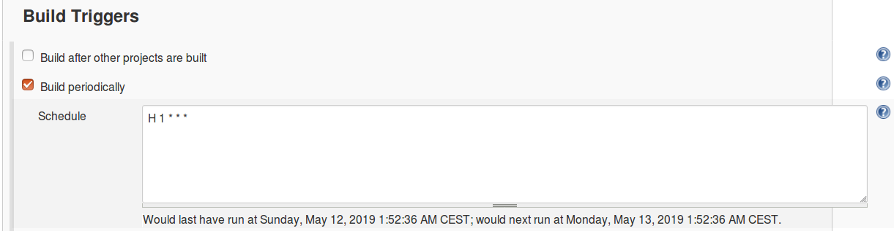
	 
   Configuración del disparador. 1:XX L-D.

Tambien se podía haber optado por poner *@midnight* que lo ejecutaría en cualquier momento entre 12:00 AM y 2:59 AM.

Generar la imagen de *nightly*
^^^^^^^^^^^^^^^^^^^^^^^^^^^^^^

Para obtener la tag de nightly hay que leer el *pom.xml* del proyecto. Para ello se usa el script *pom_version_updater.py* descrito en la sección `Editor de version para Maven Projects`_. Una vez obtenida la versión sin sufijo se construye la tag con formato x.y.x.nightly.YYMMDD llamando al comando *date*.

Para construir la imagen docker se usa el script *build-image-with-tag.sh* que ya se usa en el job de *merge*.

Finalmente se publica con *docker push*.

Código groovy:

.. code:: groovy

	stage('Create Candidate Image') {

	    def getVersion = '''docker run --rm \
             -v codeurjc-forge-jenkins-volume:/app \
             -w /app/workspace/\$JOB_NAME/continous_integration/pom_version_updater/ \
             atonich/python3-lxml \
             sh -c "python3 pom-version-updater.py -r ../../pom.xml"'''
	    
	    def currentVersion = sh(returnStdout: true, script: getVersion).trim()
	    def theDate = sh(returnStdout: true, script: 'date +%Y%m%d').trim()
	    tag = currentVersion + '.nightly.' + theDate
	    echo tag

	    //puts the variable into the enviroment
	    env.tag = tag
	    
	    sh ''' mv target/*.jar continous_integration/build/'''
	    sh ''' cd continous_integration/build && \
	                                  ./build-image-with-tag.sh "$tag"'''
	    
	    withDockerRegistry(credentialsId: 'atonich_dockerhub') {
		sh ''' docker push atonich/tic-tac-toe-testing:"$tag"'''
	}
	  

Verificar la imagen tic-tac-toe:X.Y.Z.nightly.YYYYMMDD
^^^^^^^^^^^^^^^^^^^^^^^^^^^^^^^^^^^^^^^^^^^^^^^^^^^^^^

Lanzar test de sistema contra la App corriendo en una imagen, requiere modificar los test de sistema para que no lenvanten la aplicación al ejecutarse, y que lean la URL de la applicación como un parámetro de entrada. Se ha añadido por tanto el flag *-DDontStartApp* y la propiedad *-DAPP_URL*.

Código Java para leer estos parámetros desde los tests de sistema:

.. code:: java

	  @BeforeClass
	  public static void setupClass() {
	     if (Boolean.getBoolean("DontStartApp"))
	        return;

	     WebApp.startOnPort("7070");
	   }

	   @AfterClass
	   public static void teardownClass() {
	      if (Boolean.getBoolean("DontStartApp"))
	         return;

	      WebApp.stop();
	   }

          ...
	   
	  public String getAppUrl() {
	    return System.getProperty("APP_URL");
	  }

	  @Test
	  public void TicTacToeWeb_Generic_System_Test() throws InterruptedException {
	     for(RemoteWebDriver driver : drivers) {
	        driver.get(this.getAppUrl());
	     }

	  ...

Así pues para usarlo primero hay que levantar un contenedor con la aplicación. Luego decirle a los tests que no levanten la aplicación e indicarles en qué dirección está nuestro contenedor escuchando.

.. code:: groovy

  stage('Verify Image')
  {
      env.tag = tag
      sh '''docker run --rm -d --name nigthly_job \
      -p 7070:8080 \
      atonich/tic-tac-toe-testing:"$tag"'''

      sh '''docker run --rm \
      -v /var/run/docker.sock:/var/run/docker.sock \
      -v $HOME/.m2:/root/.m2 \
      -v codeurjc-forge-jenkins-volume:/src \
      -w /src/workspace/\$JOB_NAME \
      maven:3.6.1-jdk-8 \
      /bin/bash -c \
      "mvn test -DAPP_URL=http://10.0.2.15:7070/ \
		     -DDontStartApp=true \
		     -Dtest=TicTacToeWebTest.java"'''

  }

Tras los tests habrá que parar el contenedor de la aplicación.  Esto se hace al final del job y no en la misma fase en la que se lanzan los tests. Esto es así para asegurar que la linea de *docker stop* siempre se ejecuta. Si se pusiera justo despues de ejecutar los tests, en el caso de alguno fallará la siguiente linea no se ejecutaría y el contenedor nunca se pararía.

.. code:: groovy

  finally {

     ...

      //clean up
     sh '''git clean -dfx'''
     sh '''docker stop $(docker ps -a --filter "name=nigthly_job" \
				      --format "{{ .Names }}") || true'''
     sh '''docker rmi $(docker images -f "dangling=true" -q) || true'''
  }
	  

Limpieza en ocasiones se crean imagenes sin nombre *dangling*. Es una buena práctica eliminarlas tras la creación de imagenes con docker rmi.

Los comandos que paran la imageen docker y que borran las imágenes podría fallar si no hay contenedor corriendo o si no hay imágenes sin nombre. Se añade *|| true* para el que pipeline no falle en estos casos.
    
   
Publicar la imagen de *nightly*
^^^^^^^^^^^^^^^^^^^^^^^^^^^^^^^

Si lo tests pasan se retagea la imagen y se vuelve a subir. No es necesario por tanto crear una nueva imagen. Basta con usar el comando *docker tag*.

.. code:: groovy

  stage('Publish Nightly Image')
  {
      env.tag = tag
      sh '''docker tag atonich/tic-tac-toe-testing:"$tag" \
                                 atonich/tic-tac-toe-testing:nightly'''
      withDockerRegistry(credentialsId: 'atonich_dockerhub') {
	  sh '''docker push atonich/tic-tac-toe-testing:nightly'''
      }
  }
	  

Pipeline completo
^^^^^^^^^^^^^^^^^

.. code:: groovy

    node {
	def tag = ''
	stage('Preparation') {

	    final scmVars = checkout(
		[$class: 'GitSCM', branches: [[name: '*/master']],
		 doGenerateSubmoduleConfigurations: false,
		 extensions: [], submoduleCfg: [],
		 userRemoteConfigs: [
			[credentialsId: 'hudson_gerrit',
			 url: 'ssh://10.0.2.15:29418/tic-tac-toe-testing']]]
	    )
	    echo "scmVars: ${scmVars}"
	    echo "scmVars.GIT_COMMIT: ${scmVars.GIT_COMMIT}"
	    echo "scmVars.GIT_BRANCH: ${scmVars.GIT_BRANCH}"
	}
	try {
	    stage('Build') {
		sh '''docker run --rm \
		    -v $HOME/.m2:/root/.m2 \
		    -v codeurjc-forge-jenkins-volume:/src \
		    -w /src/workspace/\$JOB_NAME \
		    maven:3.6.1-jdk-8 \
			/bin/bash -c "mvn package -DskipTests"'''
	    }
	    stage('Repository Test') {
		sh '''docker run --rm \
		      -v /var/run/docker.sock:/var/run/docker.sock \
		      -v $HOME/.m2:/root/.m2 \
		      -v codeurjc-forge-jenkins-volume:/src \
		      -w /src/workspace/\$JOB_NAME \
		      -p 7070:7070 \
		      maven:3.6.1-jdk-8 \
		      /bin/bash -c "mvn test -DAPP_URL=http://10.0.2.15:7070/"'''
	    }
	    stage('Create Candidate Image') {

	      def getVersion = '''docker run --rm \
	       -v codeurjc-forge-jenkins-volume:/app \
	       -w /app/workspace/\$JOB_NAME/continous_integration/pom_version_updater/ \
	       atonich/python3-lxml \
	       sh -c "python3 pom-version-updater.py -r ../../pom.xml"'''

	      def currentVersion = sh(returnStdout: true, script: getVersion).trim()
	      def theDate = sh(returnStdout: true, script: 'date +%Y%m%d').trim()
	      tag = currentVersion + '.nightly.' + theDate
	      echo tag

	      //puts the variable into the enviroment
	      env.tag = tag

	      sh ''' mv target/*.jar continous_integration/build/'''
	      sh ''' cd continous_integration/build && \
		     ./build-image-with-tag.sh "$tag"
		 '''

	      withDockerRegistry(credentialsId: 'atonich_dockerhub') {
		  sh ''' docker push atonich/tic-tac-toe-testing:"$tag"'''
	      }
	    }
	    stage('Verify Image')
	    {
		env.tag = tag
		sh '''docker run --rm -d --name nigthly_job \
		    -p 7070:8080 \
		    atonich/tic-tac-toe-testing:"$tag"'''

		sh '''docker run --rm \
		    -v /var/run/docker.sock:/var/run/docker.sock \
		    -v $HOME/.m2:/root/.m2 \
		    -v codeurjc-forge-jenkins-volume:/src \
		    -w /src/workspace/\$JOB_NAME \
		     maven:3.6.1-jdk-8 \
		     /bin/bash -c \
		         "mvn test -DAPP_URL=http://10.0.2.15:7070/ \
		                   -DDontStartApp=true \
		                   -Dtest=TicTacToeWebTest.java"'''
	    }
	    stage('Publish Nightly Image')
	    {
		env.tag = tag
	        sh '''docker tag atonich/tic-tac-toe-testing:"$tag" \
	                         atonich/tic-tac-toe-testing:nightly
		   '''
		withDockerRegistry(credentialsId: 'atonich_dockerhub') {
		    sh '''docker push atonich/tic-tac-toe-testing:nightly'''
		}
	    }
	}
	catch (exc){
	    echo 'Build Failed'
	    currentBuild.result = 'FAILURE'
	}
	finally {
	    stage('Result'){
		archiveArtifacts 'target/*.flv'
		junit 'target/**/*.xml'
	    }
	    //clean up
	    sh '''git clean -dfx'''
	    sh '''docker stop $(docker ps -a --filter "name=nigthly_job \"
	                                     --format "{{ .Names }}") || true'''
	    sh '''docker rmi $(docker images -f "dangling=true" -q) || true'''
	}
    }
	  

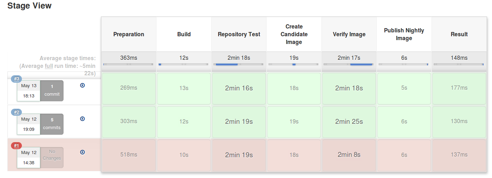
	 
   Ejemplo de ejecuciones del job de *nightly*.

    
Job de release, tic-tac-toe-release-scm
----------------------------------------

El job *tic-tac-toe-release-scm* es de tipo Pipeline, tiene configurado el trigger manual.

Recibe un parámetro con la version que seguirá a la que se está publicando. Ejecuta los tests unitarios y de sistema, si estos pasan publica una image docker con los tags de la version actual y latest. Después actualiza el pom.xml con la siguiente version y empuja el commit.

Este job introduce algunas novedades con respecto a los anteriores jobs. Merece la pena detenerse en ellas.

Pipeline Scripted Parametrizado
^^^^^^^^^^^^^^^^^^^^^^^^^^^^^^^^

Parametrizar un job tan solo requiere añadir la directiva *parameters* al script. No hace falta tener un nodo para ejecutar estas lineas.

Para hacer obligatorio un parámetro basta con comprobar su valor y fallar la build si no cumple con las espectativas.

.. code:: groovy

    properties([
	parameters([
	    string(defaultValue: '',
		   description: 'Next Version after the release',
		   name: 'nextVersion'),
	])
    ])

    if (params.nextVersion == '') {
	echo 'Build Failed: nextVersion parameter is mandatory'
	currentBuild.result = 'FAILURE'
	return
    }
    echo "nextVersion: ${params.nextVersion}"
	  

Push de una tag o commit desde Jenkins
^^^^^^^^^^^^^^^^^^^^^^^^^^^^^^^^^^^^^^

El plugins de Git SCM debería ayudar en estas tareas sin embargo tiene un bug reportado y no arreglado que limita su funcionalidad en este área.
Existe numerosos *workarounds* para solventar esta limitación. Todos con sus ventajas y sus inconvenientes.

`Enlace al bug del plugin de Git <https://issues.jenkins-ci.org/browse/JENKINS-28335>`_.

Una de las soluciones propuestas en el hilo del bug es usa el pluging *ssh Agent* y ejecutar en él comandos de git. El gran inconveniente de este método es que supone configurar todo el soporte
de git dentro del job, lo que derivará en problemas de código repetido y/o mantenibilidad en el futuro. A favor tiene que  es una solución sencilla y rápida de implementar.

`Enlace a una de la soluciones <https://issues.jenkins-ci.org/browse/JENKINS-28335?focusedCommentId=269000&page=com.atlassian.jira.plugin.system.issuetabpanels%3Acomment-tabpanel#comment-269000>`_.

Por tanto en este job no se usa el plugin de Git y se descarga el repository de la siguiente forma:

.. code:: groovy

    sshagent(['hudson_gerrit']) {
	sh '''git clone ssh://hudson@10.0.2.15:29418/tic-tac-toe-testing.git .
              gitdir=$(git rev-parse --git-dir)
              scp -p -P 29418 hudson@10.0.2.15:hooks/commit-msg ${gitdir}/hooks/
              git config user.name "hudson"
              git config user.email hudson@example.com
           '''
    }
	  
Para poder hacer push de commits a gerrit es necesario instalar los hooks y configurar el usuario en el repositorio.

El código que crea y sube una tag:

.. code:: groovy

	stage('Tag Git commit')
	{
	    env.tagVersion = tagVersion
	    sshagent(['hudson_gerrit']) {
		sh '''
                     git tag -am "$tagVersion" "$tagVersion"
                     git push --tags
                   '''
	    }
	}
	  
Crear un commit, subirlo, hacer la revisión de código y mergear. Se hace uso de la interfaz ssh que ofrece gerrit.

.. code:: groovy

    sshagent(['hudson_gerrit']) {
	sh ''' git add pom.xml
               git commit -m "Update to version $nextVersion"
               git push origin HEAD:refs/for/master
               ssh -p 29418 hudson@10.0.2.15 gerrit review \
                   --code-review +2 --submit $(git rev-parse HEAD)
           '''
    }

Existe otra solución más mantenible y que no depende de ningún plugin de Git. Crear un fichero .ssh/config con una entrada que establezca el archivo de clave privada y el usuario para conectarse a gerrit. Crear otro fichero global de configuración de Git donde se configure el usuario y su email. Es simple y robusta. Es la que yo elegiría en un entorno de producción. No es la implementada en la practica por dos razones. Una es experimentar con otras soluciones usando plugins de Jenkins y la otra es evitar tocar el código de la forjar para que el contenedor de Jenkins incluya estos dos ficheros al levantarse.
    

Permisos de gerrit para el usuarios de jenkins
""""""""""""""""""""""""""""""""""""""""""""""

Para poder tagear el repositorio y subir la version en el *pom.xml* hay que dar permiso a *hudson*, el usuario que usa Jenkins para interactuar con gerrit.

Para poder subir la versión creando un commit y mezclándolo.

::
   
  - refs/for/*   Push Allow to Non-Interactive Users
  - refs/heads/* Label Code Review  Allow -1, -2 to Non-Interactive Users
  - refs/heads/* Submit Allow to Non-Interactive Users

Para poder subir *Annotated tags*

::
   
   - refs/tags/* Create Annotated Tag to Allow Non-Interactive Users

Limpiado de *workspace*
^^^^^^^^^^^^^^^^^^^^^^^

Una de las consecuencias de no usar el plugin de Git SCM es que reusar la copia local del repositorio de Git se hace inmanejable y peligroso.
Lo mejor será limpiar complementamente el espacio de trabajo usando la directiva que ofrece Jenkins.

.. code:: groovy

    finally {
	//clean up
	cleanWs()
    }
	  
Limpia incondicionalmente el espacio de trabajo.

Edición del pom.xml
^^^^^^^^^^^^^^^^^^^

Se hace uso del anteriormente descrito pom-version-updater descrito en la sección `Editor de version para Maven Projects`_.

Elimina *-SNAPSHOT* de pom 

.. code:: python
	  
	  pom-version-updater.py -c -i ../../pom.xml

Lee la version del pom

	  
.. code:: python
	  
	  pom-version-updater.py -r ../../pom.xml

Escribe la version x.y.z-SNAPSHOT cuando se le pasa x.y.z como parámetro

.. code:: python
	  
	  pom-version-updater.py -v "x.y.z" -i ../../pom.xml
	  

Pipeline completo
^^^^^^^^^^^^^^^^^

.. code:: groovy

  properties([
      parameters([
	  string(defaultValue: '',
		 description: 'Next Version after the release',
		 name: 'nextVersion'),
      ])
  ])

  if (params.nextVersion == '') {
      echo 'Build Failed: nextVersion parameter is mandatory'
      currentBuild.result = 'FAILURE'
      return
  }
  echo "nextVersion: ${params.nextVersion}"

  node {
    try {
      def tagVersion = ''
      stage('Preparation') {
	 // configure git enviroment due to the found bug in git-plugin
	 // see the memoria.pdf documentation.
	 sshagent(['hudson_gerrit']) {
	    sh '''
	       git clone ssh://hudson@10.0.2.15:29418/tic-tac-toe-testing.git .
	       gitdir=$(git rev-parse --git-dir)
	       scp -p -P 29418 hudson@10.0.2.15:hooks/commit-msg ${gitdir}/hooks/
	       git config user.name "hudson"
	       git config user.email hudson@example.com
	       '''
	    }
      }

      stage('Remove Version Suffix') {
	sh '''
	  docker run --rm \
	   -v codeurjc-forge-jenkins-volume:/app \
	   -w /app/workspace/\$JOB_NAME/continous_integration/pom_version_updater/ \
	   atonich/python3-lxml \
	   sh -c "python3 pom-version-updater.py -c -i ../../pom.xml"'''

	 def getVersion = '''docker run --rm \
	    -v codeurjc-forge-jenkins-volume:/app \
	    -w /app/workspace/\$JOB_NAME/continous_integration/pom_version_updater/ \
	    atonich/python3-lxml \
	    sh -c "python3 pom-version-updater.py -r ../../pom.xml"'''

	 tagVersion = sh(returnStdout: true, script: getVersion).trim()
	 echo "Releasing Version: ${tagVersion}"
      }
      stage('Build') {
	      sh '''docker run --rm \
	      -v $HOME/.m2:/root/.m2 \
	      -v codeurjc-forge-jenkins-volume:/src \
	      -w /src/workspace/\$JOB_NAME \
	      maven:3.6.1-jdk-8 \
	      /bin/bash -c "mvn package -DskipTests"'''
      }

      try {
	  stage('Test') {
	      // Run the build
	      sh '''docker run --rm \
		      -v /var/run/docker.sock:/var/run/docker.sock \
		      -v $HOME/.m2:/root/.m2 \
		      -v codeurjc-forge-jenkins-volume:/src \
		      -w /src/workspace/\$JOB_NAME \
		      -p 7070:7070 \
		      maven:3.6.1-jdk-8 \
		      /bin/bash -c "mvn test -DAPP_URL=http://10.0.2.15:7070/"'''
	  }
      }
      finally {
	  stage('Result'){
	      archiveArtifacts 'target/*.flv'
	      junit 'target/**/*.xml'
	  }
      }
      stage('Publish Release Image') {
	  env.tagVersion = tagVersion
	  sh ''' mv target/*.jar continous_integration/build/'''
          sh ''' cd continous_integration/build && \
                 ./build-image-with-tag.sh "$tagVersion"'''
          sh '''docker tag atonich/tic-tac-toe-testing:"$tagVersion" \
                           atonich/tic-tac-toe-testing:latest'''
	  
	  withDockerRegistry(credentialsId: 'atonich_dockerhub') {
	      sh ''' docker push atonich/tic-tac-toe-testing:"$tagVersion"'''
	      sh ''' docker push atonich/tic-tac-toe-testing:latest'''
	  }
      }
      stage('Tag Git commit')
      {
	  env.tagVersion = tagVersion
	  sshagent(['hudson_gerrit']) {
	      sh '''
		   git tag -am "$tagVersion" "$tagVersion"
		   git push --tags
		 '''
	  }
      }
      stage('Create New Version')
      {
	env.nextVersion = params.nextVersion
	sh '''
	  docker run --rm \
	    -v codeurjc-forge-jenkins-volume:/app \
	    -w /app/workspace/\$JOB_NAME/continous_integration/pom_version_updater/ \
	    atonich/python3-lxml \
	    sh -c "python3 pom-version-updater.py -v $nextVersion -i ../../pom.xml"
	   '''
	sshagent(['hudson_gerrit']) {
	    sh ''' git add pom.xml
		   git commit -m "Update to version $nextVersion"
		   git push origin HEAD:refs/for/master
		   ssh -p 29418 hudson@10.0.2.15 gerrit review \
		       --code-review +2 --submit $(git rev-parse HEAD)
	       '''
	}
      }
    }
    catch (exc){
	echo 'Build Failed'
	currentBuild.result = 'FAILURE'
    }
    finally {
	//clean up
	cleanWs()
    }
  }
	  
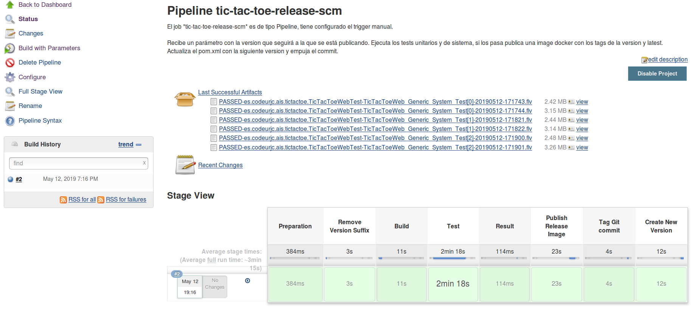
	 
   Ejemplo de ejecución del job de *release*.

Mejoras
==========

En este apartado me gustaría hablar de los aspectos que mejoraría en esta forja aunque fuera del alcance de esta práctica sobre todo por falta de tiempo.

**Red**: Creo que el apartado más mejorable es el de la gestión de Red. Tal y como está hecha la forja los contenedores obtienen una IP de la red del host lo que hace *bailar* la IP de todos los contedores dependiendo de si el portátil está en casa o en la oficina. Creo que merece la pena crear *networks* para aislar la forja y asegurar que los contenedores siempre se ven entre sí.

**IPs y URLs**: Está relacionado con el punto anterior. Los jobs, y la configuración de Jenkins está llena de referencias a la IP y/o urls de los demás servicios. Estro presenta problemas de mantenibilidad, que se solucionarían con algunas técnicas.

  - Introduciendo estos parámetros en la configuración de Jenkins usando el código que genera y gestiona la forja.
  - Usando variables globales en Jenkins que se inyectan en los jobs. Por ejemplo: GERRIT_URL=10.0.2.15.
  - Levantando un servidor DNS que evite usar IPs directamente.

**Base de datos para SonarQube**: Habría que cambiar la base de datos de este servicio. Ahora corre con la local de pruebas.

**Criterio de Gating propio para SonarQube**: Establecer un criterio propio, investigar plugins. Creo que se le puede sacar más partido a esta herramienta.

**Voto Verify en Gerrit**: Jenkins debería votar con un verify -1, +1 en gerrit. Esto es sencillo de configurar.

**Backups**: Hacer backups de todo es básico. Un sistema de backups es de lo primero que montaría en un entorno de producción. Seguro que docker también facilita esta tarea.

Conclusión
==========

Ha sido un trabajo muy completo con muchísimos conceptos puestos en práctica. Es la base de un oficio complejo que aporta muchísimo valor al ecosistema software. Particularmente me ha parecido muy útil y he aprendido bastante.

Quizás, fruto de su completitud, es que sea extremadamente compleja. Hay una gran cantidad de software interactuando y me he encontrado con numerosos problemas de inestabilidades y  bugs. Es cierto que el mundo real es así, pero es más sencillo enfrentarse a los problemas cuando los conceptos ya están claros y asentados.

En cuanto a la adecuación de la práctica a los contenidos, considero que nos ha faltado tiempo en la asignatura para poder exigir un trabajo como este. Me hubiera gustado detenernos más en Jenkins, sus plugins y sobre todo el lenguaje groovy. Por otro lado en clase no conseguimos hacer funcionar TestContainer, sin embargo se pide en la práctica. Es una de las partes que más tiempo lleva y la más prescindible desde mi punto de vista. En Erisson no hacemos programación web por lo general.
